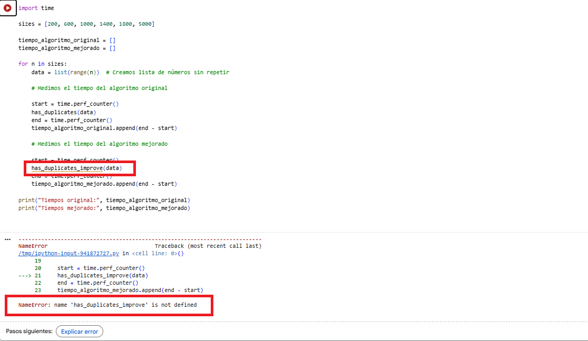

# Ejercicio 1

En esta serie de ejercicios trabajaremos sobre la eficiencia temporal de los algoritmos. Analizaremos, optimizaremos y compararemos diferentes implementaciones de un problema sencillo: detectar si una lista contiene elementos duplicados.

El objetivo es entender cómo la elección de un enfoque u otro en la implementación puede modificar de forma notable el rendimiento de un algoritmo.
Recordad que el rendimiento de un algoritmo no solo depende del tamaño de la entrada, sino también de sus valores específicos.
Por este motivo, al analizar la eficiencia se suele considerar el caso peor, es decir, aquel en el que el algoritmo requiere el mayor número de operaciones para completarse.

## 1.1 

En este ejercicio debéis analizar la complejidad temporal del siguiente código y expresar su orden de complejidad.
A partir del siguiente algoritmo, determinad su complejidad en notación O, justificando brevemente vuestra respuesta..

def has_duplicates(num_list: list[int]) -> bool:
    """
    Checks whether a list of ints contains duplicate values.

    Args:
        num_list (list[int]): List of integers to analyze.

    Returns:
        bool: True if duplicates are found, False otherwise.
    """
    for k in range(len(num_list)):
        for v in range(k + 1, len(num_list)):
            if num_list[k] == num_list[v]:
                return True
    return False

### Ejercicio 1.1 – Análisis de complejidad temporal

El algoritmo de esta función compara cada elemento de la lista con los siguientes elementos para comprobar si existen valores duplicados. Primero, se selecciona un elemento de la lista y, a continuación, se compara con el resto de los elementos que aparecen después. 
El problema es que el algoritmo va a realizar comparaciones entre todos los pares posibles de elementos cuando no haya valores duplicados. Esto va a hacer que el número de operaciones aumente de forma cuadrática.Si la lista de números es pequeña, no supondrá un problema, pero como la lista sea muy grande, el tiempo de ejecución puede llegar a ser demasiado lento.

#### Referencias

Para resolver este ejercicio he revisado ejemplos de recorridos de listas en los apuntes de la Unidad 4: Optimización de código: complejidad algorítmica y profiling.

Para entender mejor por qué los bucles anidados hacen crecer el número de comparaciones de forma cuadrática, revisé una explicación con un ejemplo de doble bucle en Stack Overflow.

https://stackoverflow.com/questions/64132613/python-complexity-of-on2-number-of-jumps-in-list

### Ejercicio 1.2 

En este ejercicio debéis mejorar el algoritmo has_duplicates de manera que reduzca su complejidad temporal. Para ello, cread una nueva función llamada has_duplicates_improved e implementad el código correspondiente.

Comprobad que ambas versiones producen el mismo resultado al probarlas con diferentes entradas. Para ello, añadid una verificación adicional usando assert. Una vez mejorada, indicad la complejidad temporal del nuevo algoritmo y explicad brevemente en qué consiste la mejora respecto a la versión original.

#### Mi propuesta de código:

def has_duplicates_improved(num_list: list[int]) -> bool:
    """
    Checks whether a list of ints contains duplicate values using a set.

    Args:
        num_list (list[int]): List of integers to analyze.

    Returns:
        bool: True if duplicates are found, False otherwise.
    """
    seen = set() # Creo un conjunto como memoria
    for num in num_list: # Este bucle va a recorrer la lista completa
        if num in seen: # Que el número está en la lista
            return True # Si la respuesta es sí, hay un duplicado
        seen.add(num) # Se añade el duplicado a la lista
    return False

#### Pruebo las dos funciones

# Listas de prueba
prueba_sin_duplicados = [3, 7, 12, 25, 41]
prueba_con_duplicados = [5, 9, 2, 9, 14]

# Verificamos usando assert

assert has_duplicates(prueba_sin_duplicados) == has_duplicates_improved(prueba_sin_duplicados)
assert has_duplicates(prueba_con_duplicados) == has_duplicates_improved(prueba_con_duplicados)

print("Ambas funciones producen el mismo resultado")

#### Aparece un error

#### Error

Aparece el primer error de código al llamar a la función. El error se producía al intentar acumular el timepo de escucha usando la instrucción "+=" sobre una clave del diccionario que no había sido incializada aún. 

**Error detectado**

Según el error, la función `has_duplicates_improved` no estaba definida en el momento de ejecutar, el error se produjo porqueno había ejecutado la celda del algoritmo mejorado, al ejecutarla se solucionó.

#### Explicación de la mejora

La aplicación original busca pares repetidos comparando cada elemento con todos los que vienen después usando dos bucles, lo que provoca que se repitan muchas comparaciones. Esto hace que la aplicación se relentice a medida que listado sea más grande. 

En la aplicación mejorada, se usa un conjunto como memoria, usando set(), para detectar los valores que ya han aparecido, por lo que la lista solo se recorre una vez, haciendo más eficiente el código.

SM Ejercicio 1.3

En este ejercicio debéis comparar el tiempo de ejecución de los dos algoritmos que verifican si una lista contiene elementos duplicados: el algoritmo dado y vuestra versión mejorada.

Generad listas de estos tamaños con elementos sin repetir y medid el tiempo de ejecución de ambos algoritmos para cada tamaño.

Representad los resultados en una gráfica que muestre cómo crece el tiempo de ejecución en función del tamaño de la lista (n).

Comentad las diferencias observadas entre ambos algoritmos, relacionándolas con sus complejidades teóricas.

Utilizad los siguientes tamaños de lista:

sizes = [200, 600, 1000, 1400, 1800, 5000]

#### Referencias: 
 
Documentación Unidad 4
https://docs.python.org/3/tutorial/datastructures.html#sets

