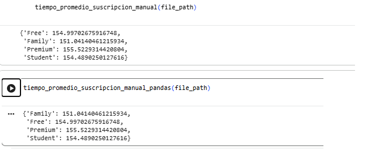

## Ejercicio 2
En este ejercicio dispondréis de un conjunto de datos llamado music_dataset.csv, que contiene información sobre usuarios de una plataforma de música en línea. El fichero incluye variables como el país, la edad del usuario, el tipo de suscripción, el tiempo total de uso de la plataforma, un indicador que muestra si el usuario sigue activo o ha abandonado el servicio, etc.

El objetivo es analizar el rendimiento de dos estrategias distintas de lectura y procesamiento de datos para determinar cuál resulta más eficiente en términos de tiempo y recursos.

### Ejercicio 2.1 

Debéis implementar dos funciones que calculen el tiempo promedio de reproducción por tipo de suscripción (subscription_type). Tenéis la columna listening_time.

Implementación A: realizad la lectura del archivo de forma manual utilizando las funciones integradas de Python (open() y read()), procesando línea a línea los datos para calcular el promedio.

Implementación B: implementad la misma funcionalidad utilizando la librería pandas, aprovechando sus métodos (read_csv, groupby y mean).

Ambas funciones deben recibir únicamente el parámetro path: str, correspondiente a la ruta del fichero de datos. En ambos casos, no debe realizarse ningún tipo adicional de manipulación ni mostrar información por pantalla. Las funciones deberán únicamente devolver un diccionario con el resultado calculado.

#### Toca resolver

En la primera implementación, la A, hay que hacer la lectura del archivo CSV manualmente usando las funciones que ya están integradas en Python. Procedimiento que voy a seguir:

-Leer la cabezera del archivo para identificar las columnas y usar las que necesitamos para el ejecicio: "subscription_type" y "listening_time"
-Recorrer el archivo línea a línea
-Acumular el tiempo total de eschuca y el número de registros para cada tipo de suscripción, esto lo haré con el uso de diccionarios.
-Calcular el promedio dividiendo la suma total entre el número de registros por suscripción.

En la segunda implementación, la B, hay que hacer lo mismo pero con la función pandas. Procedimiento que voy a seguir:

- Cargar el archivo CSV en un Dataframe
- Agrupar los datos por "subcription_type".
- Calcular la media de la columna " listening_time mediante el método mean ().

#### Voy a probar si funcionan ambas funciones Phython y Pandas

##### Error

Aparece el primer error de código al llamar a la función. El error se producía al intentar acumular el timepo de escucha usando la instrucción "+=" sobre una clave del diccionario que no había sido incializada aún. 

*Línea del problema:*
sums[subscription] += listening_time

Para resolverlo

Sustituyo la operación `+=` por el uso del método `get()`, inicializando el acumulador a 0.0 cuando el tipo de suscripción aparece por primera vez. 

##### Vuelvo a intentarlo, ahora sí funcionan ambas

### Referencias

*Explicación del método `get()` de los diccionarios en Python:*
https://thedataschools.com/python/diccionarios/get-metodo-diccionario.html

https://ellibrodepython.com/leer-archivos-python

https://www.datacamp.com/es/tutorial/pandas

