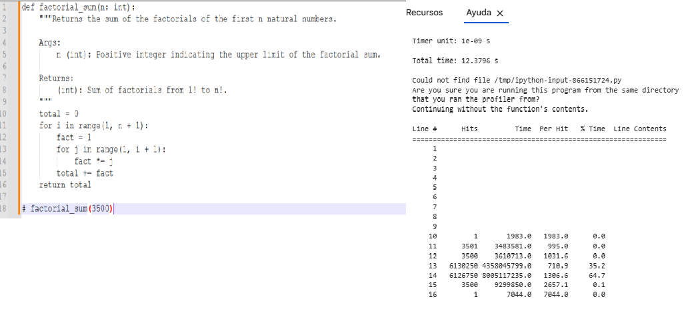
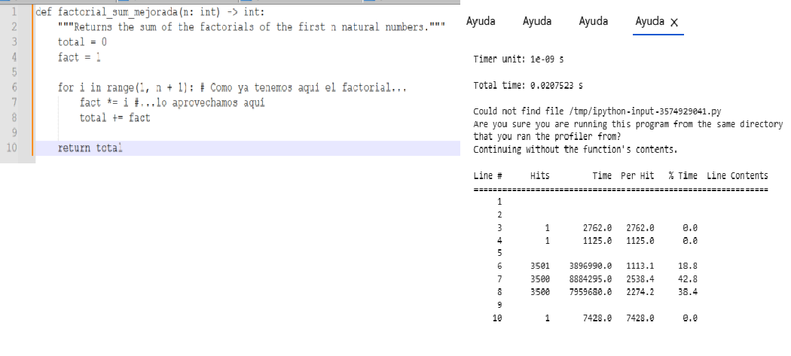

## Ejercicio 3
En este ejercicio detectaréis las ineficiencias y mejoraréis el código. En este caso, vamos a analizar el cálculo de la suma de los factoriales de los primeros n números naturales.

### Ejercicio 3.1 
Utilizando las herramientas de profiling que hemos visto en el Notebook de teoría, analizad el siguiente fragmento de código ineficiente y encontrad cual es el cuello de botella. Explicad las ineficiencias que habéis detectado, relacionándolas con los resultados obtenidos en el profiling.

#### Vamos a usar  las herramientas de análisis de rendimiento: %timeit y %lprun.

**Resultado %timeit**

4.12 s ± 738 ms per loop (mean ± std. dev. of 7 runs, 1 loop each)

**Resultado %lprun**

#### Conclusión

En esta función, la herramienta %lprun muestra un número muy elevado de ejecuciones en el bucle interno encargado de calcular el factorial:

- La operación fact *= j se ejecuta millones de veces.

- Esta línea concentra aproximadamente el 64 % del tiempo total de ejecución.

### Ejercicio 3.2 

Mejorad el código con el objetivo de reducir el tiempo de ejecución. Además, comentad la mejora realizada, indicando la complejidad temporal y si ésta ha mejorado respecto a la versión anterior.

Al mejorar la aplicación, las principales operaciones se ejecutan una vez por iteración, haciendo que el tiempo de ejecución se reparta de forma equilibrada en el bucle. Se puede apreciar que hay 3.500 ejecuciones por línea y no más de 6 millones como pasaba en la aplicación original.

