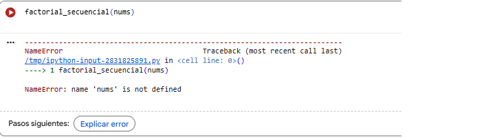
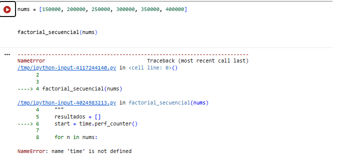
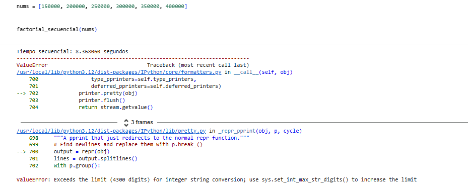

## Ejercicio 4
En este ejercicio trabajaremos con el módulo multiprocessing para comparar la ejecución secuencial frente a la paralela de una misma tarea computacional.

### EG Ejercicio 4.1

Se proporciona una función que, dado un número entero, calcula su factorial utilizando la función math.factorial(). A partir de esta función ya implementada, se pide desarrollar dos nuevas funciones:

Versión secuencial: Implementar una función que reciba una lista de números y calcule el factorial de cada uno de ellos de forma secuencial, midiendo y mostrando el tiempo total de ejecución en segundos.

Versión con multiprocesamiento: Implementar otra función que realice el mismo cálculo, pero utilizando múltiples procesos mediante el módulo multiprocessing, también mostrando el tiempo total de ejecución.

Ambas funciones deberán utilizar la misma lista de entrada y permitir comparar el rendimiento entre la ejecución secuencial y la paralela.

IMPORTANTE: Dependiendo del sistema, el multiproceso puede no funcionar directamente en un notebook. Si esto ocurre, deberás empaquetar las funciones en un módulo Python (.py) aparte.

#### Función factorial secuencial.

def factorial_secuencial(nums: list[int]) -> list[int]:
    """
    Computes the factorial of a list of integers sequentially and measures execution time.

    Args:
        nums (list[int]): list of numbers to be calculated.

    Returns:
        (list[int]): list with the factorial of each number.
    """
    start = time.perf_counter()

    resultados = []
    for n in nums:
        resultados.append(calcular_factorial(n))

    tiempo_ejecucion = time.perf_counter() - start
    print(f"Tiempo secuencial: {tiempo_ejecucion:.6f} segundos")

    return resultados

#### Llamo a la función para probarla

factorial_secuencial(nums)

#### Error

Cuando llamo a la función para probarla, me sale este error:

**Solución**

No había definidido la lista de números, la función no tenía aún la variable nums, así que definino la lista.

nums = [150000, 200000, 250000, 300000, 350000, 400000]

Y pruebo de nuevo

factorial_secuencial(nums)

**Otro error**

Otro error de mi "Talon de Aquiles", no había ejecutado la celda de la función calcular_factorial, en la que venían los módulos time y math. Ejecuto y vuelvo a probar de nuevo la función.

factorial_secuencial(nums)

**Otro error**

Durante la ejecución de la versión secuencial, el cálculo de los factoriales se completó correctamente y el tiempo de ejecución se mostró sin problemas. Sin embargo, al intentar devolver la lista completa de resultados, se produjo un `ValueError` relacionado con la conversión de enteros muy grandes a cadena.

**Solución**

Este error aparece porque Python pone un límite al número de dígitos que se pueden convertir a texto. No es un fallo del cálculo ni del código: el problema surge cuando el notebook intenta mostrar en pantalla números tan grandes como estos factoriales.

Como aquí el objetivo es medir el tiempo de ejecución y no leer un número interminable, lo que hago es mostrar solo información derivada del resultado. Así puedo comprobar que el cálculo se ha realizado correctamente sin que el entorno falle al intentar imprimir los valores.

res = factorial_secuencial(nums)
print("Resultados calculados:", len(res))

## Ejercicio 4.2 

### EG Ejercicio 4.2

###  Ejercicio 4.2

**¿Cuál ha sido el tiempo total de ejecución para cada función?**

En la ejecución realizada, la versión secuencial ha tardado aproximadamente **6,91 segundos**, mientras que la versión que utiliza multiprocessing ha tardado alrededor de **8,20 segundos**. 

**¿Consideras que el uso de multiprocessing resulta igual de eficiente con valores pequeños de n que con valores grandes de n al calcular factoriales?**

No. Con valores pequeños de n, el uso de multiprocessing suele ser menos eficiente. Cuando la lista de números es reducida, el coste asociado a la creación de procesos y a la gestión del paralelismo puede ser mayor que el propio tiempo de cálculo.

En este caso concreto, aunque los valores de n son grandes, el número de tareas a paralelizar es reducido, por lo que no se consigue amortizar el coste adicional del paralelismo.

**¿Qué factores pueden hacer que una ejecución paralela sea incluso más lenta que una secuencial?**

Algunos factores que pueden provocar que una ejecución paralela sea más lenta que una secuencial son:

- El overhead asociado a la creación y destrucción de procesos.
- El coste de comunicación y sincronización entre procesos.
- Un número reducido de tareas o una mala granularidad del trabajo.
- Limitaciones de CPU, memoria o del propio entorno de ejecución.
- El uso de entornos como notebooks, donde multiprocessing puede introducir sobrecostes adicionales.

#### Referencias

-Python Software Foundation. multiprocessing — Process-based parallelism.
 https://docs.python.org/es/3.14/library/multiprocessing.html

-Python Software Foundation. threading — Thread-based parallelism.
 https://docs.python.org/3/library/threading.html

-Material de clase: Notebook 5. Optimización, paralelismo y concurrencia.

