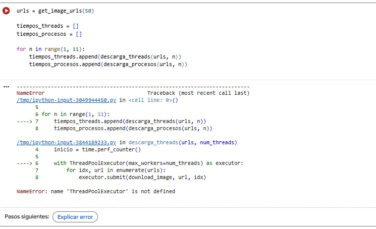
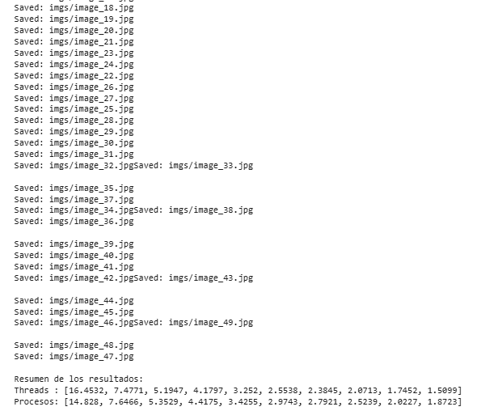

### Ejercicio 5.1 

Lo primero que debéis hacer es calcular el tiempo base de descarga, es decir, cuánto tarda el proceso en completarse de manera secuencial para las `n=50` imágenes.
Este valor servirá como referencia para poder comparar posteriormente con otras implementaciones.

Tendréis que implementar una función que recorra la lista de URLs y descargue todas las imágenes una a una, llamando a la función `download_image(url, idx)` para cada elemento.
Durante el proceso, debéis medir y mostrar el tiempo total de ejecución, de forma que se pueda conocer cuánto tarda el proceso secuencial completo.

**Nota:**

Antes de comenzar la descarga, asegurad que existe la carpeta donde se almacenarán las imágenes (por ejemplo, imgs/).
Para ello, se recomienda utilizar la función `os.makedirs()` con el parámetro `exist_ok=True`, que permite crear la carpeta automáticamente en caso de que no exista.

### Ejercicio 5.2 

En la práctica, existen distintas estrategias para mejorar el rendimiento de un programa que realiza tareas repetitivas o con tiempos de espera, como la descarga de archivos desde Internet.

Valora y determina si en este caso sería más adecuado implementar una solución concurrente (multithreading) o una solución paralela (multiprocessing), justificando la elección.

Indica en qué tipo de situaciones consideras que sería más apropiado aplicar la estrategia que NO elijas para este problema, incluyendo algún ejemplo de uso.

**1.**

Esta función va a descargar imágenes de una API, así que dependerá de la respuesta de un servidor externo, por lo que la solución multiprocessing no es la ideal. La opción multithreading sería más idónea, ya que mientras un hilo espera la red para descargarse una imagen, otros avanzan. Si se están descargando 50 como en este caso, con multithreading mejoraría el rendimiento total del proceso.

**2.**

Cuando se trate de situaciones en las que el cuello de botella sea el cálculo, la estrategia más adecuada sería utilizar multiprocessing. En estos casos, el trabajo puede dividirse en varios procesos que se ejecutan en distintos núcleos de la CPU, reduciendo el tiempo total de ejecución.

Un ejemplo de este tipo de situaciones sería un algoritmo que tenga que realizar cálculos estadísticos sobre una base de datos muy amplia. Otro ejemplo sería el entrenamiento o la evaluación de un modelo de *machine learning*, donde cada proceso puede encargarse de una parte del cálculo de forma independiente.
#### Error 

**Solución**

Importar from concurrent.futures import ThreadPoolExecutor, ProcessPoolExecutor

Durante la ejecución de las pruebas de descarga, se muestra esto: 

La salida tiene mucho ruído y es de la línea del código de la función download_image, así que no la voy a tocar y dejo la salida tal cual.

#### Referencias y Recursos

**Documentación Oficial**
* [Standard Library: concurrent.futures](https://docs.python.org/es/3/library/concurrent.futures.html) - Guía principal sobre ejecución asíncrona en Python.
* [ProcessPoolExecutor Class](https://docs.python.org/es/3/library/concurrent.futures.html#concurrent.futures.ProcessPoolExecutor) - Documentación técnica sobre el pool de procesos.

**Tutoriales y Video-Guías**
* [Implementación de ThreadPoolExecutor](https://youtu.be/SyJYiH9EcOk) - Tutorial paso a paso sobre el uso de pools de hilos.
* [Concurrencia en Python: Descarga de URLs](https://youtu.be/fU_WlPMQPZU) - Ejemplo práctico de gestión de peticiones de red concurrentes.

